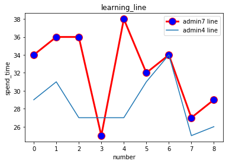

# 点标注分析


```python
import os 
import pandas as pd
from datetime import datetime
import json
import matplotlib.pyplot as plt 

#文件读取并获得总数和子目录
def printPath(level, path):  
    global allFileNum  
    global fileList
    dirList = []  
    fileList = []  
    files = os.listdir(path)  
    dirList.append(str(level))  
    for f in files:  
        if(os.path.isdir(path + '/' + f)):  
            if(f[0] == '.'):  
                pass  
            else:  
                dirList.append(f)  
        if(os.path.isfile(path + '/' + f)):  
            fileList.append(f)
    for fl in fileList:  
        allFileNum = allFileNum + 1
    return fileList

# 时间间隔计算
def DtCalc(stTime, edTime):
    st=datetime.strptime(stTime, "%Y-%m-%dT%H:%M:%S")
    ed=datetime.strptime(edTime, "%Y-%m-%dT%H:%M:%S")
    rtn = ed -st
    return rtn

#时间价格转数字
def timedelta_tonumber(bb):
    c=[]
    k=0
    for i in bb:
        if k<len(bb)-1:
            d = DtCalc(bb[k],bb[k+1])
            c.append(d)
            k+=1
    return [v.seconds for v in c ]

#计算平均数
def averagenum(num):
    nsum = 0
    for i in range(len(num)):
        nsum += num[i]
    return nsum / len(num)

#计算中位数
def mediannum(num):
    listnum = [num[i] for i in range(len(num))]
    listnum.sort()
    lnum = len(num)
    if lnum % 2 == 1:
        i = int((lnum + 1) / 2)-1
        return listnum[i]
    else:
        i = int(lnum / 2)-1
        return (listnum[i] + listnum[i + 1]) / 2

#计算众数
def publicnum(num, d = 0):
    dictnum = {}
    for i in range(len(num)):
        if num[i] in dictnum.keys():
            dictnum[num[i]] += 1
        else:
            dictnum.setdefault(num[i], 1)
    maxnum = 0
    maxkey = 0
    for k, v in dictnum.items():
        if v > maxnum:
            maxnum = v
            maxkey = k
    return maxkey
```


```python
# 分析开始读取文件
allFileNum=0
path='C:/Users/52/Desktop/bD13/'  #换文件需要改的参数
pass_ratio=0.5 #点标注通过率

printPath(1,path)  
print ('总文件数 =', allFileNum)  

records=[]
for i in range(0,len(fileList)):
    with open(path+fileList[i],'rb') as load_f:
        load_dict1 = json.load(load_f)
        records.append(load_dict1)

#转dataframe是为了分割方便
frame=pd.DataFrame(records)
data=frame.loc[:,['assigned_username','submitted_at']]
data.assigned_username.unique() #看一下有多少个人参与标注
admin={'admin1':str(data.assigned_username.unique()[0]),'admin2':str(data.assigned_username.unique()[1])}

a1=data[data.assigned_username==str(admin.get('admin1'))]
a2=data[data.assigned_username==str(admin.get('admin2'))]


#dataframe转list为了算时间方便
b1=a1.submitted_at.tolist()  
b2=a2.submitted_at.tolist()  
b1.sort()  #时间排序，同样为了便于计算
b2.sort()

#计算消耗的时间
time_spend1=timedelta_tonumber(b1)
time_spend2=timedelta_tonumber(b2)
print (str(admin.get('admin1')),time_spend1,str(admin.get('admin2')),time_spend2)


#记录下来标注的点的数量
try:
    count2_list=[rec['logs'][2]['checks'][0].get('result').get( 'count2') for rec in records]
    count1_list=[rec['logs'][2]['checks'][0].get('result').get( 'count1') for rec in records]
    pass_count_list=[rec['logs'][2]['checks'][0].get('result').get( 'pass_count') for rec in records]
    max_len=max(len(count2_list),len(count1_list))
except:
    print('存在未标注样本')


#计算单个任务的点通过率并打印
count=0
try:
    for r in pass_count_list:
        if r / float(max_len)>=pass_ratio:
            count+=1
except:
    print('list is None')
print('相似度',count/float(allFileNum))


#绘制消耗时间图即为学习曲线
allFileNum1=int(allFileNum/2-1)
y1=timedelta_tonumber(b1)
y2=timedelta_tonumber(b2)
x1=range(0,allFileNum1) 
x2=range(0,allFileNum1) 
plt.plot(x1,y1,label=str(admin.get('admin1'))+' '+'line',linewidth=3,color='r',marker='o', markerfacecolor='blue',markersize=12) 
plt.plot(x2,y2,label=str(admin.get('admin2'))+' '+'line') 
plt.xlabel('number') 
plt.ylabel('spend_time') 
plt.title('learning_line') 
plt.legend() 
plt.show() 


```

    总文件数 = 20
    admin7 [34, 36, 36, 25, 38, 32, 34, 27, 29] admin4 [29, 31, 27, 27, 27, 31, 34, 25, 26]
    list is None
    相似度 0.0
    





```python
print(str(admin.get('admin1'))+'的平均数: ',averagenum(time_spend1))
print(str(admin.get('admin2'))+'的平均数: ',averagenum(time_spend2))
print(str(admin.get('admin1'))+'的中位数: ',mediannum(time_spend1))
print(str(admin.get('admin2'))+'的中位数: ',mediannum(time_spend2))
print(str(admin.get('admin1'))+'的众数: ',publicnum(time_spend1))
print(str(admin.get('admin2'))+'的众数: ',publicnum(time_spend2))
```

    admin7的平均数:  32.333333333333336
    admin4的平均数:  28.555555555555557
    admin7的中位数:  34
    admin4的中位数:  27
    admin7的众数:  34
    admin4的众数:  27
    

# 框标注数据分析


```python
import pyclipper

#每个框IOU计算函数
def count_iou(marks1, marks2) -> float:
    sub1 = [(d.get('x'), d.get('y')) for d in marks1]
    sub2 = [(d.get('x'), d.get('y')) for d in marks2]
    pc = pyclipper.Pyclipper()
    pc.AddPath(sub1, pyclipper.PT_CLIP, True)
    pc.AddPaths((sub2,), pyclipper.PT_SUBJECT, True)
    solution = pc.Execute(pyclipper.CT_INTERSECTION, pyclipper.PFT_EVENODD,
                          pyclipper.PFT_EVENODD)
    intersection_area = 0
    for s in solution:
        intersection_area += pyclipper.Area(s)
    #print(intersection_area)
    #print(pyclipper.Area(sub1))
    #print(pyclipper.Area(sub2))
    union_area = abs(pyclipper.Area(sub1)) + abs(pyclipper.Area(sub2)) - intersection_area
    iou = intersection_area / float(union_area)
    #print("IOU Count: %f" % iou)
    #print(marks1)
    #print(marks2)
    return iou
```


```python
#标注员与审核员对比，看一下差异。这里打印出的是每个框的IOU,返回的是该任务标注是否通过
def call(marks1,marks2,iou_value,pass_ratio):
    a1_len = int(len(marks1)/4)
    a2_len = int(len(marks2)/4)
    max_len = a1_len
    if max_len < a2_len:
        max_len = a2_len
    used = set()
    score = 0
    for i in range(0, a1_len):
        max_iou = 0
        max_idx = -1
        for j in range(0, a2_len):
            if j in used:
                continue
            iou = count_iou(marks1[:4*j+4], marks2[:4*j+4])
            print(iou)
            if max_iou < iou:
                max_iou = iou
                max_idx = j
        if max_iou > iou_value:
            score += 1
            used.add(max_idx)
            #print(max_iou)
   # reason = {
    #    'passed_count': score,
     #   'count1': a1_len,
     #   'count2': a2_len
    #}
    if score / float(max_len) > pass_ratio:
        return True
    return False

```


```python

frame1=pd.DataFrame(records)
data1=frame1.loc[:,['assigned_username','annotations']]
data_dot1=data1[data1.assigned_username==str(admin.get('admin1'))]['annotations']
data_dot2=data1[data1.assigned_username==str(admin.get('admin2'))]['annotations']

iou_value=0.8 #参数设计
pass_ratio=0.5 #参数设计


marks1=[]
marks2=[]
result_bool=[]


for i in range(0,allFileNum1+1):
    for j in data_dot1[2*i]:
        marks1.extend(j.get('marks'))
    for k in data_dot2[2*i+1]:
        marks2.extend(k.get('marks'))
        z+=1
    IOU_try=call(marks1,marks2,iou_value,pass_ratio)
    
    result_bool.append(IOU_try)
    marks1=[]
    marks2=[]
```

    0.967553048616707
    0.8966108966108967
    0.9688264974771444
    0.9703611678054841
    0.9423572312736275
    0.9853956178929435
    0.8679426989286144
    0.9585053066037735
    0.7856443719412725
    0.7071754458730817
    


```python
IOU_result=sum(result_bool)/(allFileNum1+1)
print(IOU_result)
```

    0.8
    
