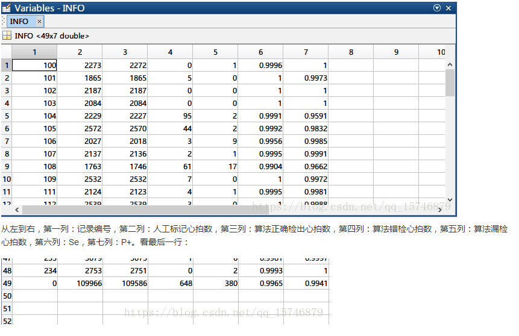
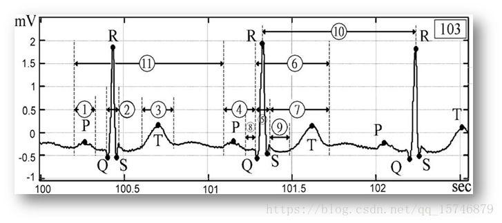
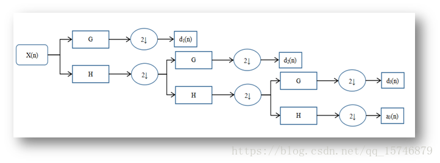

# 心电算法总结

ECG，是electrocardiogram的缩写。就是我们平时常见的心电图。典型的心电信号由P波，QRS波，T波等一系列特征波组成，它们以及一些特征段（QRS间期，ST段，PR段等）包含着丰富的病理信息。

医生就是通过分析这些波形的特点，结合自己的经验给出诊断结果。我们的目的，就是研究如何有效利用机器/深度学习算法以及一些数字信号处理算法，使用ECG信号，实现对一些心血管异常的诊断。

## 数据库简介与获取

https://www.physionet.org/cgi-bin/atm/ATM  
这个网站上汇集了许许多多生理信号，除了我们熟悉的ECG，还有脑电信号EEG，心音信号PCG等等。

.atr：标记文件，保存着人工标注的心拍位置和类型。.dat:数据文件，保存着我们需要的心电信号。.hea：头文件，保存着这条记录的附加信息。这三个文件中头文件（.hea）可以直接打开，其余两个不可直接打开，强行记事本打开后看到的都是乱码。打开头文件后，一般看到的是这样的：

第一行含义为：记录编号 导联数 采样率 采样点数。第二、三行则说明了.dat文件的信息，它是212格式编码的等等。

## 数据库的Matlab读取


```python
#from IPython.display import Image
#Image(filename='./0000.png')
```


至此，我们已经成功将数据库中的ECG信号读取至matlab中。另外，workspace中其余2个矩阵也值得我们注意。如3）中的workspace截图，一个是ANNOT，存储了该记录中各心拍的人工标注类型代码

## QRS心拍定位: 解决识别对象问题

对于大多数研究/论文来说,并不是所谓的记录,而是ECG的基本单位:心拍
- 一条充分长的记录中包含的信息太多，可能包含了很多种类型的心拍，直接全局处理不利于精细的识别。
- 一条充分长的记录数据量偏大，若一次性全局投入后端机器/深度学习算法，不利于复杂而又大量的迭代。
- 目前可用的开源数据库数据量偏少，若直接以一条记录为一个算法处理单位，则总体样本量大大下降，不利用机器学习，尤其是深度学习的应用。以MIT-BIH数据库为例，若以记录为单位处理，则只有48个样本；若以心拍为单位处理，样本量可达10W+。

我们读到Matlab中的ECG数据都是以记录形式存在的，包含了形态各异，数量不等的心拍。
一般来说通过检测QRS波的位置，可以大体定位心拍所在的位置。

### 基本思想

为什么用QRS波确定心拍位置
- 直观来看，各类型心拍的各波段中，QRS波往往是最大、最明显的、最尖锐的，本身就利于检测；而在数学上，称为QRS波的“奇异性”，表现为斜率的突变，存在不可导的点，即波峰（或波谷）点。利用该性质可配合多种处理手法，如差分法，小波变换法等等进行有效检测。

### 基本步骤

预处理+自适应阈值的QRS波定位。

预处理的目的在于两点：
1. 消除噪声和其他的杂波（P波，T波）等。 
2. 使波形模式变得更为单一，QRS波的变化更为突出。

预处理完成后，配合自适应阈值完成QRS波的定位。
1. 自适应的意思是能够适应不同类型的记录。自适应机制越好的算法，能够在各种类型的记录下良好地区分目标与非目标，从而达到很高的准确率和可用度。
2. 自适应阈值的设计原则，个人总结如下：
   - 自适应阈值变换机制中的经验参数需固定。在自适应阈值的变化机制中，有些参数可能需要我们根据经验提前设定好。这没有问题。但是一旦确定好之后检测性能时，对于不同的记录，这些经验参数不可以再重新设定。
   - 自适应阈值要跟随波形实时地，稳健地变化。自适应阈值，并不是至给一整条记录计算好一个阈值后就一成不变了，而是要跟随波形实时地变化，例如当检测到的QRS波振幅呈总体上升态势时，自适应阈值也要相应地提高，反之则要相应降低；自适应阈值的变化往往不可过于剧烈，可通过设定上下限的方式使其变化更加稳健。
   - 自适应阈值要有针对性地防错检、漏检的机制。例如可以回溯之前的波形，再次进行检测防止漏检；利用“不应期”（当一个QRS波出现后，短时间（~0.24s）内不会再出现第二个）的含义，在检测到一个QRS波后短时间内不再检出QRS波，防止错检。当然并不是说有了这些机制就完全可以避免错检漏检，而是有效地减少。

### QRS波定位算法设计与评估

在QRS波识别领域，不得不提的就是经典的Pan-Tompkins算法[1]和Cuiwei Li等人发表的小波变换法。

一个QRS波定位算法进行分析。

1.预处理。

 这一部分的总体步骤图如下：

 （1）我们对心电信号进行40阶FIR带通滤波，通带为15~25Hz，大致为QRS波所在频段。关于滤波器的设计可以使用Matlab的Fdatool工具，得到相应的滤波器系数，然后套用filter内建函数完成滤波。、
 
 通过对比可以看到，滤波后P波，T波被明显削弱，体现了上一部分中预处理目的的第一点。

（2）对滤波后的波形“双斜率”预处理。所谓“双斜率”：基本思想是分别在一个点的左右两侧的某个区间内寻找最大平均斜率与最小平均斜率，然后分别用左侧最大斜率减去右侧最小斜率，用右侧最大斜率减去左侧最小斜率，再求取两者中的最大者。过程有些复杂，但其实其基本动机就是利用QRS波两侧较陡的性质，只有QRS波这样的尖峰在经过上述处理时才会有很大的响应。在这里，我们设定这个寻找斜率的区间是左右两侧0.015s~0.060s处，双斜率处理后，波形模式更为单一，体现了预处理目的的第二点。但是，波形出现了双峰现象，一定程度上不利于精准检测。因此，在双斜率处理后继续低通滤波（截止频率5Hz，经验参数），使得波形更光滑：低通滤波后的波形变得非常光滑，杂波基本消失，模式也非常单一，基本上已经达到了进一步阈值处理的要求。

（3）滑动窗口积分。仔细观察前几步，每一步得到的波形由于滤波或是求斜率的因素，其幅度值越来越小，而过小的幅值其实不利于检测。这里我们利用滑动窗口积分，使得绝对振幅增大，并使波形进一步光滑，滑动窗口宽度设为17个采样点，为经验参数：积分后，波形幅值明显增大（注意纵坐标），体现了预处理目的的第二点。

至此，预处理阶段完成，经过处理后，原始的心电信号变成了一个个模式单一的波峰组成的信号，每个波峰对应一个QRS波。相比原信号，预处理后的信号更易定位检测，可以说达到了预处理的目的。
 
 

2)自适应阈值设计与上述所说的自适应阈值设计原则相契合，这个算法的思路是：

（1）自适应阈值要跟随信号实时变化。问题是如何决策此时阈值的变化。这里我采用了一种常用的策略：双阈值。一高一低，当某个波峰超过低阈值时，我们认为检测到了一个QRS波，然后通过比较波峰振幅与高低阈值的关系，调整阈值。

（2）为了保证变化的稳健，阈值需要根据前面已经检测到的正确波峰振幅变化，另外设定下限，以确保不会过高或过低。通过以上两点，我设计自适应机制如下（THR1为高阈值，THR2为低阈值）：
具体来说，当当前波峰高于高阈值时，我们倾向于认为此时阈值偏低，阈值变化为之前检测到的8个波峰平均值的0.7倍，0.25倍（均为经验系数），如果相比最近的8个峰值，阈值确实偏低程度很大，则就算乘上了一个小于1的系数（例如0.7，0.25），自适应阈值还是会增大，如果偏低程度不大，则不一定增大。之所以乘上系数还是因为要保持变化的稳健，保证只有阈值明显偏低时才会明显增大；当当前波峰在高低阈值之间，我们倾向于调低高阈值，而低阈值要与高阈值保持距离，因此也倾向于调低一些，不过我们倾向于认为此时的波形较为异常（因为较小，在两阈值之间），不宜根据前面的平均峰值变化，因此此时阈值变化与当前波峰的值相关。另外重复一下，当波峰低于低阈值时，认为是噪声。

（3）防漏检与错检。其实本身双阈值的设计一定程度上就可以防漏检。因为一高一低的阈值，相比只有一个阈值，可以捕捉到更多层次的波峰。另外在防错检方面，我采用了“不应期”的方式，当两个波峰过于靠近时，只取较大的波峰。这个“过近”指的是距离低于0.24s，即不应期的长度；双阈值的变化存在下限，也防止了一些噪声被错检为QRS波。
另外，双阈值的初始值是被提前设定好的经验系数，与其他经验系数一样，一旦确定就不会因记录的不同而变化。体现了上述自适应阈值设计的第（1）原则。

以上阈值的操作，均在原信号预处理后的特征信号上进行，检测到的波峰都认为对应于原信号中的一个QRS波。另外预处理中的两次滤波都造成了信号的延迟，我们检测到特征信号的波峰后，可减去延迟，即可得到原信号中的QRS波的位置。

注意,这里检测的"正确"并非是指精准地落在QRS波的波峰或波谷中,尽管精确的人工标注往往就是在波峰或波谷上.美国EC38标准提供了一个评判标准:与人工标准差距在150ms内,即可认为定位成功.事实上,这个标准相当宽松,以至于现在的QRS波定位算法的准确率普遍在99%以上(以MIT-BIH数据库为测试数据), 而一些出色的算法甚至达到了99.9%以上.

3）算法评估
上一部分中曾说过，目前QRS波定位检测算法的“准确率”已经普遍在99%以上。但这么说其实不准确，因为衡量QRS波检测算法的指标并非我们印象中的准确率，而是有两个常用指标：敏感度（SE）和正预测率（P+）。


```python
from IPython.display import Image
Image(filename='./1532580908(1).png')

```





可以看出算法共错检648个心拍，漏检380个心拍，总体Se达到了99.65%，P+达到了99.41%

## 心拍截取

1. 这里其实有一个矛盾。无论我们的QRS波定位算法有多厉害，都很难100%将人工标注过的所有心拍定位准确，必然有错检和漏检。这就导致我们无法100%利用好人工标记的心拍。
- 这里我们采用一个折衷的手段：忽略漏检的心拍，而错检和正确检出的心拍都截取出来。由于QRS定位算法的、性能已经够好了，所以截取出来的心拍绝大多数是正确检出的心拍，只有少部分为错检心拍。
- 而我们接下来所要使用的机器/深度学习算法都具有一定的鲁棒性，较少的错检心拍数不会对结果产生太大影响。
- 至于心拍的类型（标签），我们以距离该心拍最近的人工标记的类型为准。

另外，我们截取心拍其实不是精确截取，即从P波起点到T波终点，而是采取一种较为粗略的手段：以QRS波的位置为基准，分别向前向后包括若干点，然后将这一段数据点截取出来作为心拍。

如下图所示为什么不精确截取呢？是因为检测P波和T波及其起始点或终点非常困难，目前也没有一个性能足够好的算法满足应用需求。所以，大部分文献采用的是这种粗略截取的方法，只不过前后包括的点数有区别：

## 传统机器学习:特征工程+分类器

我们先从传统机器学习框架开始，几乎所有利用传统机器学习算法进行分类的问题都遵循“特征工程+分类器”的思路，即先人工构造若干能体现样本特性的特征，然后后端选择分类器，例如支持向量机（SVM），k最近邻分类器（k-NN），决策树，贝叶斯分类器等等单个或集成的算法。然后，再不断进行优化，包括特征的选优和分类器参数的调整，达到理想的效果。

### 特征设计与分类

1）对于传统机器学习，不设计特征行不行？
我们之前已经提取了心拍，每个长度为250个采样点，那么能不能直接把这些采样点当作特征呢？

乍一想，这么做好像也没什么问题，还能省下特征提取的步骤。但其实这么做确实不是个好的选择，如果我们不做任何处理，那么特征维度就是特征点个数，为250维。对于这么多的特征，机器学习算法往往都会遭遇“维数灾难”问题，从而达不到有效学习的目的。况且，这些特征点的冗余度很大，除去信号的快变区域，相邻的几个点表征的信息几乎没有什么区别，这样做无疑也会加重分类器的负担。因此，对于ECG信号，设计有效的特征对于后端的分类来说，是很有必要的。

2）常用ECG特征

（1）ECG形态特征

通过查阅一些ECG领域的医用手册，我们可以知道，医生在通过ECG诊断心血管疾病时，其实关注的是各个波形的变化情况，例如，当QRS波变大变宽时，可能发生了室性早搏；ST段抬高时，可能发生了心肌梗死。这样，通过最直观的波形变化，结合医生的经验，可以进行疾病的诊断。所以，这就引出来了第一类常用的特征：形态特征。常用的形态特征有：

① P 波振幅 ②QRS波振幅 ③T 波振幅 ④PR间期 ⑤QRS间期 ⑥QT间期 ⑦ST间期 ⑧PR段水平 ⑨ST段水平 ⑩RR间期，如下图所示：


```python
Image(filename='./20180516181154429.png') 
```





1. 以上这些都是可以直接从ECG信号中提取到的“一级”特征，由这些特征，还可以组合为各种丰富的“二级”特征，例如例如QRS波面积（QRS间期×QRS振幅）等。
2. 对于形态特征，它的优点在于直观，可解释性强，但是缺点也很明显。那就是需要对心拍的各个波段进行精细的定位，而做到这一点是相当困难的，前面已经说过，目前除了QRS波定位检测算法已经足够成熟可靠外，其他波段的定位算法可靠性都不高。如果不能对这些波段进行精准定位，那对于后端分类器的影响是很大的。因此，在近几年的文献中，单纯使用形态特征的论文已经不多见了。

（2）ECG变换系数特征

  上面直接提取形态特征的方法虽然直接，但存在严重问题。那能不能通过一些间接的方式得到有效的，较少的，能够有效表示心拍的特征呢？目前大多数采用传统机器学习框架的论文都采用了这样一种方法：使用一些数学变换处理ECG，得到较少的系数，用这些系数来表征心拍。最常见的就是小波变换。利用小波变换能提取多尺度特征的特性，得到有效的小波系数，来表征心拍：


```python
Image(filename='./20180516181215730.png')
```





1. 从应用角度来说，可以把小波变化看作一个个级联的低通和高通滤波器，然后还有降采样操作。上图中，G和H分别表示不同的高通和低通滤波器，后接2倍降采样，a和d表示了不同尺度下的近似系数和细节系数，这些系数是跟ECG信号的内在特点相关的，通过直接使用或进一步处理这些系数，我们可以得到丰富的特征用于分类。

2. 另外，还有部分文献采用了多项式拟合的思路。即对一个心拍进行多项式拟合，得到各阶的系数作为特征。

3. 总体来说，这些使用ECG变换系数的特征，避免了对一些特征点的直接定位，从提取难度上来说小了很多。但是，付出的代价是特征的含义不再直观，这使得对于这些系数特征进行选择时变得困难，往往比较盲目。


（3）以上两种常用特征各有利弊，不过从目前的趋势来看，提取难度更小的第二种特征更受青睐。而且这些特征基于数学变换，也具有更多的理论价值和研究价值。这可能是目前此类论文较多的原因。

难点：
1. 特征选择与参数调优。
2. 个体间差异带来的性能恶化。
3. 数据稀缺。

我们是把所有提取到的心拍放在一起，然后再划分训练集和测试集的，没有考虑个体差异问题。也就是说，来自相同病人的心拍是可以同时存在于训练集和测试集中，这样使得我们的结果都很好看，我们已经得到的有标签的数据来自一些旧的病人，而我们需要根据这些数据的规律去预测新的病人。这时，个体差异性的影响会体现出来，使得我们在旧病人数据上训练的模型，难以有效泛化到新病人的数据。


## 主动学习（Active Learning）—— Patient Specific

如果多读一些关于ECG的ML/DL算法paper，可能总会看到一个词“Patient Specific”。这个词似乎没有很好的中文翻译，大概的意思是为每个病人量身定做一个分类器。首先要问的是为什么要这么做呢？

### 关于算法应用的三个层次

关于个体差异性导致的算法泛化能力恶化。个体差异性是客观存在的，而“在旧病人数据上训练，在新病人数据上测试”的模式更符合实际应用场景。从我们的期望出发，诊断算法的应用其实可以分为三个层次：

最理想：Inter-Patient，严格遵守训练集和测试集数据来自不同病人的规定，与实际应用场景最为符合，但是个体差异性带来的消极影响最大，实现难度最大。

最容易：Intra-Patient，完全不考虑个体差异性问题，训练集和测试集可以来自同一个病人，甚至刻意促成这一点，以达到更高的性能。此时，个体差异性带来的消极影响最小，实现难度最小。

在这两者中间的折衷方案，就是今天的主角：Patient-Specific。这里的训练集分为全局训练集和个体训练集，全局训练集和测试集来自不同的病人。我们用全局训练集训练一个分类器，在遇到一个新病人时，不是直接预测，而是将新病人的一小部分数据打上标签（可以理解为“偷看”标签），作为个体训练集来对分类器作微调训练，然后预测剩下的数据。这种模式还有个专门的学术称呼：主动学习（Active Learning）。

主动学习引入了额外的“专家知识”，通过与外界的交互将部分未标记样本转变为有标记样本。

在这里，我们“偷看”新病人的一小部分数据的标记，其实就相当于把这部分原来未标记的数据，请一个“专家”来给出标签，然后我们利用这些数据训练通过全局训练得到的分类器，使这个分类器学习到这个病人的个体特点，然后个体差异性所带来的性能恶化就可以大大减轻了。这也就是所谓“Patient-Specific”方案的出发点。

### 关于Patient-Specific的思考

1. 关于Patient-Specific训练集的选取。也就是说，来了一个新病人，我们选择这个病人的那一部分数据来训练，使得分类器能适应这个病人呢？直接选取前n个心拍是一个选择，但这样的选择是最能提升分类器泛化能力的吗？
  - Al Rahhal M M, Bazi Y, AlHichri H, et al. Deep learning approach for active classification of electrocardiogram signals[J]. Information Sciences, 2016, 345: 340-354 中，作者进行了探究。他们分别用了一些不同的标准（Entropy, Breaking-Ties）来给待选的新病人心拍排序，然后选择在这些标准下得分最高的若干心拍作为Patient-Specific训练集。通过跟直接选择前面的若干心拍相对比，发现这种直接选取前面若干心拍的方案的效果几乎是最差的。而那些经过精心设计的标准，则可以带来更好的表现。
2. 关于Patient-Specific的应用场景和实用性。
  - 还是跟我们之前所描述的一样，Inter-Patient方案是最理想的，但是像达到一个良好的性能，难度太大。而Patient-Specific方案则需要一些人工的干预，需要提供新病人的一小部分带标记数据。仔细想想，我们选取出的Patient-Specific训练集，其实可以相当于现实中这个病人之前的病历或就诊记录，进行适应性训练的过程，相当于为这个病人定制了一个模型。这样想的话，其实Patient-Specific方案还是有一定的实用意义的。当然，最理想情况下，高性能的Inter-Patient方案仍然是终极目标。
